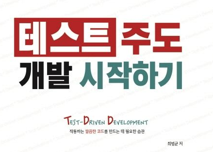

# 개발자 북클럽 - 테스트 주도 개발 시작하기

> 2024.02.28부터 2024.03.31까지 약 4주 간 진행되는 테스트 주도 개발 시작하기 스터디입니다.  
> 테스트 주도 개발 시작하기를 읽고 느낀점과 배운점을 서로 공유하고 토론합니다.
 

 

# 📒 진행 방식
- **매주 1회** 스터디 진행한다.
- 학습량에 따라 스터디 일정은 변경되며 7일을 초과하지 않는 범위에서 협의한다.
- 스터디 당일, 모든 팀원이 돌아가며 학습 내용 공유한다.
  - 서로가 느낀점에 대해 질문하고 토론한다.

# 📅 스터디 일정
- 주 1-2회 완료 목표(2/1~2/28)
- 히스토리
  - 2/1(목) : 주제 및 교재 선정 (테스트 주도 개발 시작하기 최범균 저자)
  - 2/5(토) : 교재 2단원까지 학습 후 스터디 방향 정하기
  - 2/13(화) : 교재 1회독 후 TDD 에 대한 토론
  - 2/22(목) : 각 챕터별 정리 & 테스트 코드 작성 후기 
  - 2/28(화) : 스터디 마무리 및 회고

 

# 😀 스터디 참여자

<table>

<tr>
  <td align=center>
  <a href="https://github.com/aihoshistar">
  
   
  Back-end 🖥
   
  aihoshistar
  </a>
  </td>
 
  <td align=center>
  <a href="https://github.com/crispindeity">
  
   
  Back-end 🖥
   
  crispindeity
  </a>
  </td>
  
  <td align=center>
  <a href="https://github.com/newbieJanghan">
  
   
  Back-end 🖥
   
  newbieJanghan
  </a>
  </td>
  
  <td align=center>
  <a href="https://github.com/ghlnh">
  
   
  Back-end 🖥
   
  ghlnh
  </a>
  </td>
</tr>

  
</table>

 

