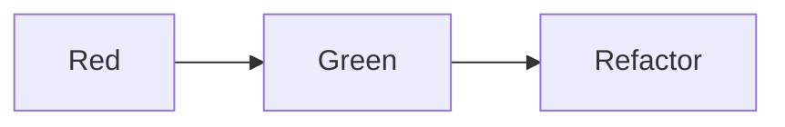
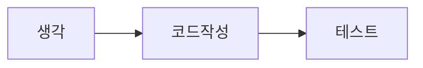
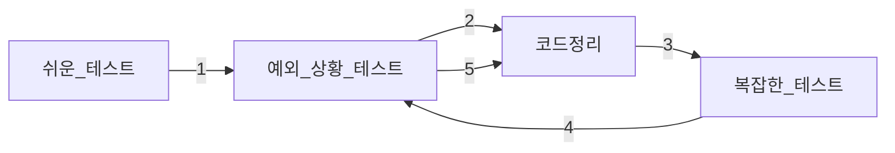

# TDD 스터디 정리(with. 테스트 주도 개발 시작하기)

## Chapter 02

### TDD 시작

#### Red-Green-Refactor


- Red: 테스트 실패
- Green: 테스트 성공
- Refactor: 리펙터링

위와 같은 흐름으로 개발을 진행.
빠른 피드백이 가능하고, 로직을 작성하면서 지속적으로 정상 동작하는 로직인지 빠르게 확인이 가능하다.

#### 기존 개발 방식


- 생각: 구조, 로직 등등 코드 작성에 앞서 어떻게 코드를 작성할지 생각
- 코드작성: 생각한 내용을 바탕으로 코드 작성
- 테스트: 작성된 코드에 대한 테스트 진행

나의 기존 개발 방식.
정작 코드를 작성하는 시간보다, 생각하는 시간이 더 많아지는 단점이 있다.(생산성 하락)
테스트가 가장 나중에 작성되기 때문에 로직을 작성하면서, 제대로 동작하는 로직인지 확인하기 어려워
심리적 불안감이 높아진다.

## Chapter 03

### 테스트 코드 작성 순서

#### 쉬운 경우에서 어려운 경우로

- 처음부터 복잡한 로직을 테스트로 작성하는 경우, 작성해야하는 코드를 작성하는 양과 시간이 많아진다. 작성된 코드의 양이 많아지면 테스트 케이스가 추가되면서 변경될 코드의 양도 많아지기 때문에 작업의 효율성이 떨어질 수 있다.
- 쉬운것부터 작성하는 경우, 코드 작성 시간이 짧아 집중하기 좋으며 테스트 케이스가 추가됨에 따라 변경되는 코드의 양도 많지 않아 작업의 효율성이 올라간다.

#### 예외 상황을 먼저 테스트

- 예외 상황을 먼저 테스트 하는 경우 분기문등이 코드 로직에 먼저 작성되기 때문에 나중에 분기문을 코드에 넣을때와 비교했을때 작업의 효율성이 더 올라가게 된다.
- 성공 케이스보다 실패 케이스가 더 중요한 만큼 초반에 예외 상황을 먼저 테스트하면 더욱 세밀하게 테스트를 작성할 수 있게 된다.

#### 한번에 작성해야하는 코드의 양

- TDD 를 접한지 얼마 안되었을때 한번에 어느정도의 코드를 작성해야하는지 모를때가 많다. `TDD` 가 익숙해지고 구현 속도를 조절할수 있게 될때 까지 불필요하다 생각될수 도 있지만 최대한 작은 부분부터 테스트가 통과되게끔 로직을 작성하는 것도 좋다.
- 예를 들어 상수를 리턴한다던지, 분기문으로 딱 주어진 경우에 한에서만 테스트가 통과하게끔 하는 구현 등

#### 목록 정리

- `TDD` 를 시작하기 전 작성할 테스트에 대한 목록을 간단하게 미리 정리하는것이 좋다.
- 정리한 목록을 통해 쉬운 테스트와 복잡한 테스트를 나누고 그걸 바탕으로 작업 우선순위를 정해 작업을 진행
- 모든 테스트 목록을 시작전에 정리하려 하면 시간이 오래 걸릴 수 있기 때문에 간단하게 정리 후 테스트를 작성하면서 추가되어야 할 테스트가 생각나는 경우 목록을 업데이트 하는 방식으로 진행하는 것이 좋다.

#### 작성 순서


- 한번에 모든 테스트 목록에 대한 코드를 적성하게 되면 나중에 코드 정리(리펙터링)을 진행할때 강한 반발력이 생기기 때문에 하나의 상황에 대한 테스트를 작성한 후 코드 정리를 진행하는 것이 좋다.
- 예외 상황의 테스트의 경우 앞서 작성된 테스트와 관련성이 있다면 다음 테스트로 넘어가기 전에 예외 상황에 대한 테스트를 작성하는 것이 좋다.

## Chapter 04

### TDD 기능 명세 설계

#### 기능 명세

- 스토리 보드 등 다양한 방법 중 적당한 방법을 선택하여 기능 명세를 작성한다.
- 작성한 기능 명세를 바탕으로 테스트를 작성하면서, 기능 명세를 구체화 시킨다.
- 한번에 모든 기능에 대한 명세를 작성하려 하면 오히려 빼먹는 경우가 발생할 여지가 높아지기 때문에, 우선 큰 틀에서 기능 명세를 작성한 후 테스트를
  진행하면서 구체화 시키고 연관 부서와 의논하는 방향으로 업무를 진행하는 것이 효율적이다.

#### 설계

- TDD 는 테스트를 통과할 만큼만 코드를 작성한다. 필요할 것으로 예측하여 미리 코드를 만든면 안된다.
- 이는 설계에도 마찬가지로 적용되며, 필요할 것으로 예측하여 필요 이상으로 유연하게 설계를 하면 안된다.

## Chapter 06

### 테스트 코드의 구성

#### 상황(given)-실행(then)-결과(then)

- 상황-실행-결과 구조에 너무 집착하지 말자, 테스트를 작성하는데 있어 좋은 구조인건 맞으나 모든 테스트가 항상 이 구조로 만들어지지 않는다.
- 테스트에 따라 상황이 주어지지 않을수도 있으며, 각각의 테스트에 따라 상황은 다르게 주어지는데 @BeforeEach 를 사용할 수도 있고 테스트 메서드에 각각 상황을 넣어줄 수도 있다.
- 예외 상황을 테스트하는 경우 결과도 주어지지 않을 수 있다.

```java
@Test
void exactMatch() {
	// give
	BaseballGame game = new BaseballGame("456");

	// when
	Socre score = geme.guess("456");

	// then
	Assertions.assertThat(score.strikes()).isEqualTo(3);
}

@Test
void noMatch() {
	// give
	BaseballGame game = new BaseballGame("123");

	// when
	Socre score = geme.guess("456");

	// then
	Assertions.assertThat(score.strikes()).isEqualTo(0);
}
```

- 메서드 마다 상황을 설정

```java
@BeforeEach
void givenGame() {
	game = new BaseballGame("456");
}

@Test
void exactMatch() {
	// ...
}
```

- @BeforeEach 를 사용하여 상황을 설정
- 두가지 방법으로 테스트를 만들었는데, 개인적으로는 @BeforeEach 를 사용하여 상황을 설정하는건 매우 좋은 방법은 아닌것 같다. 테스트가 간단하고 개수가 적다면 상관없겠지만 테스트가 많고 복잡하다면 사용하기 어려울것 같다.

#### 외부 상황과 외부 결과

- 테스트의 성공, 실패가 테스트 외부의 상황에 따라 달라지면 안된다.
- 파일, 날짜, UUID, 외부 API 등등 우리가 직접 제어할 수 없는 부분에 의해 테스트의 결과가 달라진다면 좋지 못한 방향으로 코드 또는 구조가 설계되었을 가능성이 높다. 제어할 수 없는 부분을 최대한 밖으로 빼내어서 `mock` 또는 `stub` 등을 사용하여 외부 상황 또한 제어가 가능하도록 변경해야 한다.
  </br>
- 이 책에서 File 을 가지고 예제를 보여주고 있는데, 존재하지 않는 File 을 테스트 할때 만약 파일이 존재하면 해당 File 을 삭제하도록 예제를 만들었는데 실제 테스트를 진행할때는 테스트 관점에 따라 다르게 진행해야 할것 같다.
- EndToEnd 테스트의 경우는 위의 예제처럼 테스트를 진행해도 괜찮을것 같지만, Unit 테스트 관점에서는 차라리 File 이 없다고 가정을 한 후 진행하는게 어떨까?
