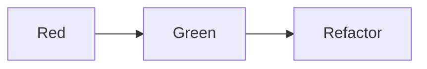

# TDD 스터디 정리(with. 테스트 주도 개발 시작하기)

## Chapter 02

### TDD 시작

#### Red-Green-Refactor


- Red: 테스트 실패
- Green: 테스트 성공
- Refactor: 리펙터링

위와 같은 흐름으로 개발을 진행.
빠른 피드백이 가능하고, 로직을 작성하면서 지속적으로 정상 동작하는 로직인지 빠르게 확인이 가능하다.

#### 기존 개발 방식


- 생각: 구조, 로직 등등 코드 작성에 앞서 어떻게 코드를 작성할지 생각
- 코드작성: 생각한 내용을 바탕으로 코드 작성
- 테스트: 작성된 코드에 대한 테스트 진행

나의 기존 개발 방식.
정작 코드를 작성하는 시간보다, 생각하는 시간이 더 많아지는 단점이 있다.(생산성 하락)
테스트가 가장 나중에 작성되기 때문에 로직을 작성하면서, 제대로 동작하는 로직인지 확인하기 어려워
심리적 불안감이 높아진다.

## Chapter 03

### 테스트 코드 작성 순서

#### 쉬운 경우에서 어려운 경우로

- 처음부터 복잡한 로직을 테스트로 작성하는 경우, 작성해야하는 코드를 작성하는 양과 시간이 많아진다. 작성된 코드의 양이 많아지면 테스트 케이스가 추가되면서 변경될 코드의 양도 많아지기 때문에 작업의 효율성이 떨어질 수 있다.
- 쉬운것부터 작성하는 경우, 코드 작성 시간이 짧아 집중하기 좋으며 테스트 케이스가 추가됨에 따라 변경되는 코드의 양도 많지 않아 작업의 효율성이 올라간다.

#### 예외 상황을 먼저 테스트

- 예외 상황을 먼저 테스트 하는 경우 분기문등이 코드 로직에 먼저 작성되기 때문에 나중에 분기문을 코드에 넣을때와 비교했을때 작업의 효율성이 더 올라가게 된다.
- 성공 케이스보다 실패 케이스가 더 중요한 만큼 초반에 예외 상황을 먼저 테스트하면 더욱 세밀하게 테스트를 작성할 수 있게 된다.

#### 한번에 작성해야하는 코드의 양

- TDD 를 접한지 얼마 안되었을때 한번에 어느정도의 코드를 작성해야하는지 모를때가 많다. `TDD` 가 익숙해지고 구현 속도를 조절할수 있게 될때 까지 불필요하다 생각될수 도 있지만 최대한 작은 부분부터 테스트가 통과되게끔 로직을 작성하는 것도 좋다.
- 예를 들어 상수를 리턴한다던지, 분기문으로 딱 주어진 경우에 한에서만 테스트가 통과하게끔 하는 구현 등

#### 목록 정리

- `TDD` 를 시작하기 전 작성할 테스트에 대한 목록을 간단하게 미리 정리하는것이 좋다.
- 정리한 목록을 통해 쉬운 테스트와 복잡한 테스트를 나누고 그걸 바탕으로 작업 우선순위를 정해 작업을 진행
- 모든 테스트 목록을 시작전에 정리하려 하면 시간이 오래 걸릴 수 있기 때문에 간단하게 정리 후 테스트를 작성하면서 추가되어야 할 테스트가 생각나는 경우 목록을 업데이트 하는 방식으로 진행하는 것이 좋다.

#### 작성 순서


- 한번에 모든 테스트 목록에 대한 코드를 적성하게 되면 나중에 코드 정리(리펙터링)을 진행할때 강한 반발력이 생기기 때문에 하나의 상황에 대한 테스트를 작성한 후 코드 정리를 진행하는 것이 좋다.
- 예외 상황의 테스트의 경우 앞서 작성된 테스트와 관련성이 있다면 다음 테스트로 넘어가기 전에 예외 상황에 대한 테스트를 작성하는 것이 좋다.

## Chapter 04

### TDD 기능 명세 설계

#### 기능 명세

- 스토리 보드 등 다양한 방법 중 적당한 방법을 선택하여 기능 명세를 작성한다.
- 작성한 기능 명세를 바탕으로 테스트를 작성하면서, 기능 명세를 구체화 시킨다.
- 한번에 모든 기능에 대한 명세를 작성하려 하면 오히려 빼먹는 경우가 발생할 여지가 높아지기 때문에, 우선 큰 틀에서 기능 명세를 작성한 후 테스트를
  진행하면서 구체화 시키고 연관 부서와 의논하는 방향으로 업무를 진행하는 것이 효율적이다.

#### 설계

- TDD 는 테스트를 통과할 만큼만 코드를 작성한다. 필요할 것으로 예측하여 미리 코드를 만든면 안된다.
- 이는 설계에도 마찬가지로 적용되며, 필요할 것으로 예측하여 필요 이상으로 유연하게 설계를 하면 안된다.

## Chapter 06

### 테스트 코드의 구성

#### 상황(given)-실행(then)-결과(then)

- 상황-실행-결과 구조에 너무 집착하지 말자, 테스트를 작성하는데 있어 좋은 구조인건 맞으나 모든 테스트가 항상 이 구조로 만들어지지 않는다.
- 테스트에 따라 상황이 주어지지 않을수도 있으며, 각각의 테스트에 따라 상황은 다르게 주어지는데 @BeforeEach 를 사용할 수도 있고 테스트 메서드에 각각 상황을 넣어줄 수도 있다.
- 예외 상황을 테스트하는 경우 결과도 주어지지 않을 수 있다.

```java
@Test
void exactMatch() {
	// give
	BaseballGame game = new BaseballGame("456");

	// when
	Socre score = geme.guess("456");

	// then
	Assertions.assertThat(score.strikes()).isEqualTo(3);
}

@Test
void noMatch() {
	// give
	BaseballGame game = new BaseballGame("123");

	// when
	Socre score = geme.guess("456");

	// then
	Assertions.assertThat(score.strikes()).isEqualTo(0);
}
```

- 메서드 마다 상황을 설정

```java
@BeforeEach
void givenGame() {
	game = new BaseballGame("456");
}

@Test
void exactMatch() {
	// ...
}
```

- @BeforeEach 를 사용하여 상황을 설정
- 두가지 방법으로 테스트를 만들었는데, 개인적으로는 @BeforeEach 를 사용하여 상황을 설정하는건 매우 좋은 방법은 아닌것 같다. 테스트가 간단하고 개수가 적다면 상관없겠지만 테스트가 많고 복잡하다면 사용하기 어려울것 같다.

#### 외부 상황과 외부 결과

- 테스트의 성공, 실패가 테스트 외부의 상황에 따라 달라지면 안된다.
- 파일, 날짜, UUID, 외부 API 등등 우리가 직접 제어할 수 없는 부분에 의해 테스트의 결과가 달라진다면 좋지 못한 방향으로 코드 또는 구조가 설계되었을 가능성이 높다. 제어할 수 없는 부분을 최대한 밖으로 빼내어서 `mock` 또는 `stub` 등을 사용하여 외부 상황 또한 제어가 가능하도록 변경해야 한다.
  </br>
- 이 책에서 File 을 가지고 예제를 보여주고 있는데, 존재하지 않는 File 을 테스트 할때 만약 파일이 존재하면 해당 File 을 삭제하도록 예제를 만들었는데 실제 테스트를 진행할때는 테스트 관점에 따라 다르게 진행해야 할것 같다.
- EndToEnd 테스트의 경우는 위의 예제처럼 테스트를 진행해도 괜찮을것 같지만, Unit 테스트 관점에서는 차라리 File 이 없다고 가정을 한 후 진행하는게 어떨까?

## Chapter 07

### 대역

#### 대역의 필요성
- 외부 연동 API 또는 DB 연동 테스트를 진행할때 대역이 없이 테스트를 진행하려 한다면, 불편한 점이 매우 많다.
- 만약 외부 API 를 통해 어떤 데이터의 검증이 필요한 로직을 테스트 하려 할때 외부 API 에서 사용할 수 있는 테스트 데이터가 주어지지 않는다면 테스트는 거의 불가능하다.
- DB 의 경우, 테스트용 DB를 사용할 수 있지만 DB 를 테스트에 사용하게 되면 신경써야하는 부분이 생각보다 많다. 먼저 개발하는 인원 마다 테스트용 DB 에 대한 설정이 필요하고 테스트의 독립성을 위해 테스트를 통해 기록된 데이터를 초기화 해줘야하는 등등 나중에는 필요할지 몰라도 개발 초기에 테스트 작성을 위해 개발외적으로 설정하는데 들어가는 시간이 많이 소요된다.
- 위의 문제 외에 여러가지 이유로 테스트를 사용할때 대역을 사용하고 있으며, 환경이나 조건에 맞게 사용하면 된다.

#### 대역의 종류

| 종류        | 설명                                                                        |
| --------- | ------------------------------------------------------------------------- |
| 스텁(Stub)  | 구현을 단순한 것으로 대체한다, 별다른 로직 없이 테스트에 맞게 단순히 원하는 동작을 수행한다.                     |
| 페이크(Fake) | 실제 사용에는 적합하지 않지만, 실제로 동작하는 구현을 제공한다.<br>(예: DB -> Map 을 사용하여 메모리에 저장하도록.) |
| 스파이(Spy)  | 호출된 내역을 기록, 기록한 내용은 테스트 결과를 검증할때 사용<br>(테스트를 진행할때 특정 메서드가 호출 됐는지 기록)      |
| 목(Mock)   | 기대한대로 상호작용을 하는지 행위를 검증할때 사용한다.<br>(Mock 은 Stub 이자 Spy 도 된다.)              |
- 나는 대체로 테스트를 진행할때 Stub 과 Fake 를 주로 사용하며, Mock 의 사용은 정말 필요한 경우 (Controller Layer 테스트 등) 에만 사용하고 있다.

#### 대역과 개발 속도
- 대역을 사용하게 되면 개발 속도를 올리는데 있어 도움이 많이 된다고 한다.
- 외부 API 에 테스트 데이터가 추가되길 기다리지 않아도 되고, 메일 전송등 통신으로 인해 기다려야하는 순간이 있을 수 있는데 그런 시간도 아낄수 있게된다.
- 특히 협업을 진행하면서, 내가 지금 개발하는 부분이 다른 분이 개발하는 부분에 대해 검증이 필요하거나 할때 다른분이 개발을 완료할때 까지 기다리는것이 아니라 기 부분을 대역으로 만들어서 빠르게 검증을 해볼 수 있다.

#### Mock
- 최근 사이드 프로젝트를 진행하면서, 테스트를 작성할때 `Fake` 와 `Stub` 을 사용했었는데 `Fake` 와 `Stub` 을 사용하기 위해 코드를 작성하는것이 불필요한 작업이지 않냐는 질문을 받은적이 있다. 그냥 `Mock` 을 사용해서 다 처리하면 되는거 아닌가? 라는 말씀을 하셨는데, 그 당시에는 그 질문에 잘 대답하지 못했던 기억이 있다.
- 이 책을 읽으면서 왜 `Mock` 을 많이 사용하면 안되는지 에 대해 다시한번 생각하게 되었다. `Mock` 을 많이 사용하게 되면 테스트 코드가 점점 복잡해진다. 그리고 테스트 대상과 Mock 의 상호 작용이 조금만 변경되더라도 테스트가 깨지기 쉬워진다. `Fake` 를 만들면서 관리해야하는 부분이 더 늘어난다고 생각했는데 `Mock` 을 사용하면 복잡도 + 관리 대상이 늘어나는 느낌이라 `Mock` 의 사용은 조금 자제하는게 좋겠다.

## Chapter 08

### 테스트 가능한 설계

#### 테스트가 어려운 코드
- 메서드 내부에서 사용하고 있는 경로, IP 주소등 하드 코딩하여 작성하는 경우 그 값을 테스트에 맞게 변경하기가 매우 까다롭기 때문에 테스트를 작성하기 어려워진다.
- 의존객체를 직접 생성하는 경우 외부에서 테스트 용도로 의존객체를 넣어줄 수 없기 때문에 대역을 사용하기 어려워 테스트 작성이 어려워진다.
- `static` 메서드를 사용하게 되면 앞선 두 가지와 마찬가지로 다양한 방식의 테스트를 진행하기 위해 환경을 설정하고 테스트에 맞는 대역등을 사용해야하는데 `static` 메서드를 사용하는 경우 변경이 어려워 테스트 작성이 어려워진다.
- 실행시점에 따라 결과가 달라지는 코드, 예를 들어 `LocalDateTime.now()` 또는 `Random()` 을 메서드 내부에서 호출하여 사용하는 경우 테스트가 어떨때는 성공하고 어떨때는 실패하고 시점에 따라 테스트 결과가 달라질 수 있다.
- 역할이 적절하게 분리되어 있지 않은 메서드의 경우 테스트를 수행하고 싶은 부분 외에 다른 부분 또한 테스트를 위해 필요로하는 코드를 작성해줘야 하기 때문에 테스트 작성이 어려워진다.

#### 테스트 가능한 설계
위에서 살펴본 테스트가 어려운 코드를 테스트를 좀 더 쉽게 작성할 수 있도록 변경해보자.
- 하드코딩된 값은 메서드의 파라미터로 전달 받거나 생성자를 통해 전달 받자.
- 의존 대상을 주입 받기, 의존 객체를 직접 생성하여 사용하는게 아니라 외부에서 주입을 받아 사용하자. 외부에서 주입을 받게 되면 상황에 맞게 주입할 객체를 변경할 수 있어 테스트를 작성하며 대역을 사용하기도 좋다.
- `private` 메서드를 테스트 하고 싶거나, 테스트를 진행해야하는데 역할이 분리되지 않아 테스트 작성에 이런저런 코드를 함께 작성해야 한다면 상황에 맞게 역할을 분리하자.
- 시간이나 임의의 값을 메서드 안에서 생성하여 사용하지 말고 외부로 최대한 빼내서 파라미터로 받아서 사용하자. 제어할수 없는걸 메서드에 깊이 위치한 상태로 사용하게되면 테스트 작성이 매우매우 어려워진다. 우리가 제어할 수 없는 값을 사용해야 한다면(UUID, now date, random 등) 최대한 외부로 빼내서 사용하자.
- 외부 라이브러리는 직접 사용하지말고, 클래스로 감싼 후 주입 받아 사용하자.

## Chapter 09

### 테스트 범위와 종류
- 테스트를 진행하는 범위에 따라 테스트 종류가 나뉜다.

#### 기능 테스트 or E2E 테스트
- 제공하는 모든 기능이 올바르게 동작하는지 확인하는 테스트이다.
- 맨 끝(Front) 부터 맨 끝(DB) 까지 테스트하기 때문에 E2E(End to End) 테스트 라고 하기도 한다.
- 보통 QA 조직에서 수행하는 테스트

#### 통합(Integration) 테스트
- 시스템의 각 구성이 올바르게 동작하는지 확인하는 테스트이다.
- 시스템의 전반적인 흐름에 맞춰 요청부터 처리 후 응답까지 동작을 정상적으로 진행하는지 코드를 직접 테스트한다.

#### 단위(Unit) 테스트
- 개별 코드나 컴포넌트가 올바르게 동작하는지 확인하는 테스트
- 하나의 클래스나 하나의 메서드와 같이 작은 범위에 대해 테스트를 진행한다.
- 일부 의존대상에 대해 대역을 사용하여 테스트를 진행

#### 통합 테스트 와 단위 테스트
- 단위 테스트 만 짜여있는 테스트는 좋은 테스트일까? 그건 아니다, 개별적으로는 잘 동작할지 모르나 개별적으로 작성된 코드를 하나의 애플리케이션으로 동작하게 했을때 문제가 발생할 수 있다.
- 통합테스트의 경우 DB, 소켓, 캐시, 서버 등 연동 대상들을 다 구성해야하고, 또 스프링에서 이런 구성요소를 다 띄워서 테스트 하기 때문에 속도가 단위 테스트와 비교했을때 매우 느린편이다. 하지만 느리다고 해서 구성요소를 구성하는게 귀찮다고 해서 통합테스트를 진행하지 않아서는 안된다.

## Chapter 10

### 테스트 코드와 유지보수

- 테스트 코드 또한 결국 유지보수가 필요한 코드다.
- 테스트를 작성할때도 기존 코드를 작성하는것과 마찬가지로 유지보수를 쉽고 편리하게 할 순 없을지 계속 고민해봐야한다.
- 유지보수성을 높이면서 각각의 테스트가 독립적으로 동작해야하고 과도하게 중복을 줄여서는 안되는.. 테스트는 작성하기도 쉽지 않지만 코드를 작성하면서도 많은 생각을 해야하는것 같다.

#### 변수나 필드값으로 기댓값 표현하지 않기

- 테스트 코드가 아닌 코드와 테스트 코드의 가장 큰 차이점이 아닐까? 테스트 코드가 아닌 코드의 경우 매직넘버를 사용하여, 코딩을 해선 안되지만 테스트 코드의 경우 가독성을 위해 필드나 변수 대신 값 자체를 사용하는것이 좋다고 한다.

#### 두 개 이상 검증하지 않기

- 하나의 테스트 코드 안에서 두 개 이상을 검증하면 안된다.
- 이왕이면 하나의 테스트 코드 안에서 하나의 검증만 진행하는것이 좋다.
- 검증을 여러개 진행할 경우 테스트 코드의 명확성이 떨어지게된다. 검증 대상을 최대한 작게 만들어 어떤 대상을 어떤 방식으로 테스트를 하는지 명확하게 만드는것이 좋다.
- 어떤 것을 사용하여 테스트하는지에 따라 조금씩 다르지만 검증을 여러개 진행할 경우 앞선 검증이 실패하면, 뒤에 검증은 진행하지 않고 뛰어 넘는 경우도 있다.
